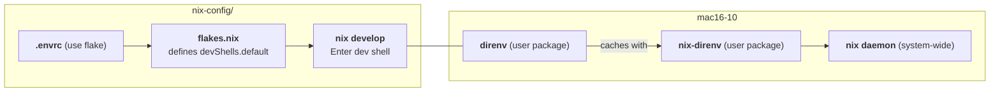

# Flake + Direnv + nix-direnv User Guide

> **Target host:** `mac16-10` (aarch64-darwin)
> **Intended audience:** Developers working on this nix-config project

---

## What This Guide Covers

This guide explains the integration of three tools that work together to give you an automatic, reproducible development environment on `mac16-10`:

| Tool | Role |
|------|------|
| **Nix Flakes** | Reproducible, composable build and dev-shell definitions |
| **direnv** | Per-directory shell environment loader (switches env on `cd`) |
| **nix-direnv** | Caching shim that makes `use flake` fast — avoids re-evaluating on every `cd` |

---

## How It Works



The chain works like this:

1. `cd` into the project directory triggers **direnv**.
2. direnv reads `.envrc` which contains `use flake`.
3. direnv delegates to **nix-direnv**, which evaluates `nix develop` against the flake's `devShells.default`.
4. **nix-direnv caches** the result so subsequent `cd` operations are nearly instant.
5. The shell gets the environment defined by the flake — Nix tools (`nil`, `alejandra`) and any other dev dependencies.

---

## Prerequisites on `mac16-10`

These are already installed by this nix-config and require no manual setup:

| Component | How It's Installed | Source |
|-----------|-------------------|--------|
| `direnv` | user package (`home.packages`) | [`flake-modules/cli-tools/homeManagerModules/default.nix`](../flake-modules/cli-tools/homeManagerModules/default.nix:8) |
| `nix-direnv` | user package (`home.packages`) | [`flake-modules/cli-tools/homeManagerModules/default.nix`](../flake-modules/cli-tools/homeManagerModules/default.nix:11) |
| Nix daemon with flakes | system-level (`nix.settings.experimental-features`) | [`flake-modules/darwin/darwinModules/default.nix`](../flake-modules/darwin/darwinModules/default.nix:13) |
| Dev shell definition | `devShells.default` in flake outputs | [`flake.nix`](../flake.nix:55) |
| `.envrc` | project root file | [`../.envrc`](../.envrc:1) |

> **New to the host?** After deploying with `darwin-rebuild switch --flake .#mac16-10`, the packages above become available to user `keith`. If direnv doesn't work right away, see [Troubleshooting](#troubleshooting).

---

## Quick Start

```bash
# 1. Clone the repository (one-time)
git clone <repo-url> nix-config
cd nix-config

# 2. Configure nix-direnv (one-time, if not already done)
mkdir -p ~/.config/direnv
echo 'source $HOME/.nix-profile/share/nix-direnv/direnvrc' >> ~/.config/direnv/direnvrc

# 3. Grant direnv permission
direnv allow

# 4. Watch the magic — nix-direnv evaluates the flake shell
#    First run is slow (builds the dev shell derivation).
#    Subsequent runs are nearly instant (cached).
```

After `direnv allow`, your shell prompt will automatically activate the flake's dev environment whenever you `cd` into `nix-config/`.

---

## What You Get

The dev shell defined in [`flake.nix`](../flake.nix:55) provides these tools in your `PATH`:

- **`nil`** — Nix language server (LSP for editors)
- **`alejandra`** — Nix formatter (`nix fmt`)

Anything else (like `git`, `ripgrep`, `jq`, `fzf`, `tmux`) is available as a system-wide package via `environment.systemPackages` in the darwin module.

---

## Examples

### Example 1: First-Time Setup

```bash
# After cloning, allow direnv
cd ~/dev/nix-config
direnv allow
```

Expected output (first run, slow — cached):

```
direnv: loading ~/dev/nix-config/.envrc
direnv: using flake
direnv: nix-direnv: using cached dev shell
...
direnv: export +AR +AS +CC +CONFIG_SHELL +CURL_CA_BUNDLE ... ~PATH
```

### Example 2: Subsequent `cd` (Fast)

```bash
cd ~/dev/nix-config
```

Expected output (near-instant — nix-direnv cache hit):

```
direnv: loading ~/dev/nix-config/.envrc
direnv: using flake
direnv: nix-direnv: using cached dev shell
direnv: export +AR +AS +CC ...
```

### Example 3: Verify the Environment

```bash
# After direnv has loaded the environment
which nil
# → /nix/store/...-nil-.../bin/nil

which alejandra
# → /nix/store/...-alejandra-.../bin/alejandra

nix fmt --check
# → (formats all Nix files in the project)
```

### Example 4: Formulating + Validating (Typical Workflow)

```bash
# Edit some Nix files, then:
nix fmt           # Format everything
nix flake check   # Fast syntax & eval check
```

The dev shell provides both tools, so no `nix shell` or global install needed.

### Example 5: Nix Develop (Without Direnv)

If you're on a machine without direnv, you can still get the same environment:

```bash
nix develop
```

This is what direnv calls under the hood. The difference is that with direnv, you don't need to remember to run it — it happens automatically on `cd`.

---

## How It's Wired Up

### The `.envrc` File

```bash
# .envrc — single line, all the power
use flake
```

This tells direnv to evaluate `nix develop` against the current flake (discovered via `flake.nix` in the same directory). The result — the flake's `devShells.<system>.default` — becomes your shell environment.

### The Dev Shell in `flake.nix`

```nix
# flake.nix — perSystem block (lines 49-61)
perSystem = { system, pkgs, ... }: {
  _module.args.pkgs-unstable = import nixpkgs-unstable {
    inherit system;
    config.allowUnfree = true;
  };

  devShells.default = pkgs.mkShell {
    packages = with pkgs; [
      nil           # Nix language server
      alejandra     # Nix formatter
    ];
  };
};
```

The `devShells.default` attribute is what `use flake` resolves. You can extend this list to include any tool you need during development — linters, compilers, test runners.

### The Packages (User-Level)

In [`cli-tools/homeManagerModules/default.nix`](../flake-modules/cli-tools/homeManagerModules/default.nix), both `direnv` and `nix-direnv` are declared as `home.packages`:

```nix
home.packages = with pkgs; [
  bat
  # ...
  direnv            # Per-directory environment variables
  # ...
  nix-direnv        # Fast cached nix-direnv for direnv
  # ...
];
```
`nix-direnv` requires one-time configuration to hook into direnv. You need to create (or edit) `~/.config/direnv/direnvrc` and source its direnvrc file:

```bash
# Create the direnv config directory
mkdir -p ~/.config/direnv

# Add nix-direnv's direnvrc
echo 'source $HOME/.nix-profile/share/nix-direnv/direnvrc' >> ~/.config/direnv/direnvrc
```

Alternatively, you can manage this with [`home-manager`'s `programs.direnv` module](https://nix-community.github.io/home-manager/options.xhtml#opt-programs.direnv.enable), which wires everything up automatically. For this project, `direnv` and `nix-direnv` are installed as plain `home.packages`, so the manual step above is needed.

Once configured, `use flake` in `.envrc` will use `nix-direnv`'s cached evaluation instead of direnv's built-in (slower) flake support.

---

## Using With Other Projects

The `direnv` and `nix-direnv` packages are installed **permanently** at the user level on `mac16-10`. Once configured, they work with **any project**, not just this nix-config repo.

### What You Need in the Other Project

For any project to get automatic dev shell loading, it needs two things:

| Requirement | Example |
|-------------|---------|
| A `flake.nix` with `devShells.default` (or a named shell) | See [How It's Wired Up](#the-dev-shell-in-flakenix) |
| An `.envrc` file in the project root with `use flake` | See [The `.envrc` File](#the-envrc-file) |

### No Additional Configuration Needed

Since `direnv` and `nix-direnv` are installed globally via home-manager, and you've already configured `~/.config/direnv/direnvrc` (see [Quick Start](#quick-start)), you can:

```bash
# Clone any flake-based project
git clone https://github.com/some-org/some-project
cd some-project

# Check if it has an .envrc
ls .envrc

# If it has .envrc with 'use flake', just allow it:
direnv allow

# If it doesn't have .envrc, create one:
echo "use flake" > .envrc
direnv allow
```

Direnv and nix-direnv will automatically use the project's own `devShells.default` — no project-specific config needed.

### Example: A Rust Project

```bash
# Any Rust project with flakes and direnv configured
git clone https://github.com/example/rust-tool
cd rust-tool

# Assume its flake.nix defines:
#   devShells.default = pkgs.mkShell {
#     packages = with pkgs; [ rustc cargo rust-analyzer ];
#   };

direnv allow
# → direnv: nix-direnv: using cached dev shell
# → Rust toolchain now in PATH automatically

cargo build  # Works without manual nix develop
```

### Example: A Node.js Project

```bash
git clone https://github.com/example/node-app
cd node-app

# Create .envrc if it doesn't exist
echo "use flake" > .envrc
direnv allow
# → direnv: nix-direnv: using cached dev shell
# → Node.js, npm, and yarn now in PATH (if defined in devShell)
```

### What If a Project Doesn't Use Flakes?

If a project uses a different direnv setup (e.g., a plain `.envrc` with `PATH_add` or `layout` commands), it still works — direnv handles those natively. `nix-direnv` only activates its caching when it sees `use flake` in `.envrc`. Other `.envrc` directives run normally.

---

## Advanced: Custom Dev Shells

You can define multiple dev shells in `flake.nix`:

```nix
perSystem = { system, pkgs, ... }: {
  devShells = {
    default = pkgs.mkShell {
      packages = with pkgs; [ nil alejandra ];
    };

    rust = pkgs.mkShell {
      packages = with pkgs; [ rustc cargo rust-analyzer rustfmt ];
    };
  };
};
```

Then switch between them with:

```bash
# Use the rust shell just this once
nix develop .#rust
```

Or reference a specific shell in `.envrc`:

```bash
use flake .#rust
```

---

## Troubleshooting

### Direnv not found

```bash
# Check if direnv is installed
which direnv
# If not found, deploy the config:
darwin-rebuild switch --flake .#mac16-10

# Then restart your shell
exec $SHELL -l
```

### Direnv not loading on `cd`

```bash
# Ensure direnv hooks into your shell
# For zsh (default on macOS):
echo 'eval "$(direnv hook zsh)"' >> ~/.zshrc
exec $SHELL -l
```

### nix-direnv cache not working (slow every time)

Verify the `.direnv` directory isn't on a filesystem that doesn't support hardlinks (e.g., some virtual/network filesystems). nix-direnv uses hardlinks for caching. The fix:

```bash
# Clear stale cache
rm -rf .direnv
direnv allow
```
### nix-direnv not providing caching (output doesn't mention "nix-direnv")

If `direnv allow` output doesn't include a line like `direnv: nix-direnv: using cached dev shell`, then nix-direnv isn't wired up. Check:

```bash
# Verify nix-direnv is installed
which nix-direnv
# → /nix/store/...-nix-direnv-.../bin/nix-direnv

# Verify the direnvrc source is present
cat ~/.config/direnv/direnvrc
# Should contain: source $HOME/.nix-profile/share/nix-direnv/direnvrc
```

If missing, configure it:

```bash
echo 'source $HOME/.nix-profile/share/nix-direnv/direnvrc' >> ~/.config/direnv/direnvrc
```

Then reload:

```bash
direnv reload
```

### Permission denied on `.envrc`


```bash
# You must explicitly allow each project's .envrc for security
direnv allow
```

---

## Reference

| Command / File | Purpose |
|----------------|---------|
| `direnv allow` | Grant permission for `.envrc` in current directory |
| `direnv deny`  | Revoke permission |
| `direnv reload` | Force re-evaluation |
| `direnv block` | Permanently ignore `.envrc` (adds to `.gitignore`) |
| `.envrc` | Per-project direnv configuration file |
| `.envrc` contains `use flake` | Tells direnv to use `nix develop` from the flake |
| `nix develop` | Enter the dev shell manually (no direnv needed) |
| `nix flake check` | Validate the flake (syntax, eval, structure) |
| `nix fmt` | Format all Nix files using alejandra |

---

## Related Documentation

- [Development Guide](./development-guide.md) — full dev workflow (validate, deploy, etc.)
- [Project Overview](./project-overview.md) — architectural overview of this nix-config
- [nix-direnv documentation](https://github.com/nix-community/nix-direnv) — official docs
- [direnv documentation](https://direnv.net/) — hook setup, advanced config
